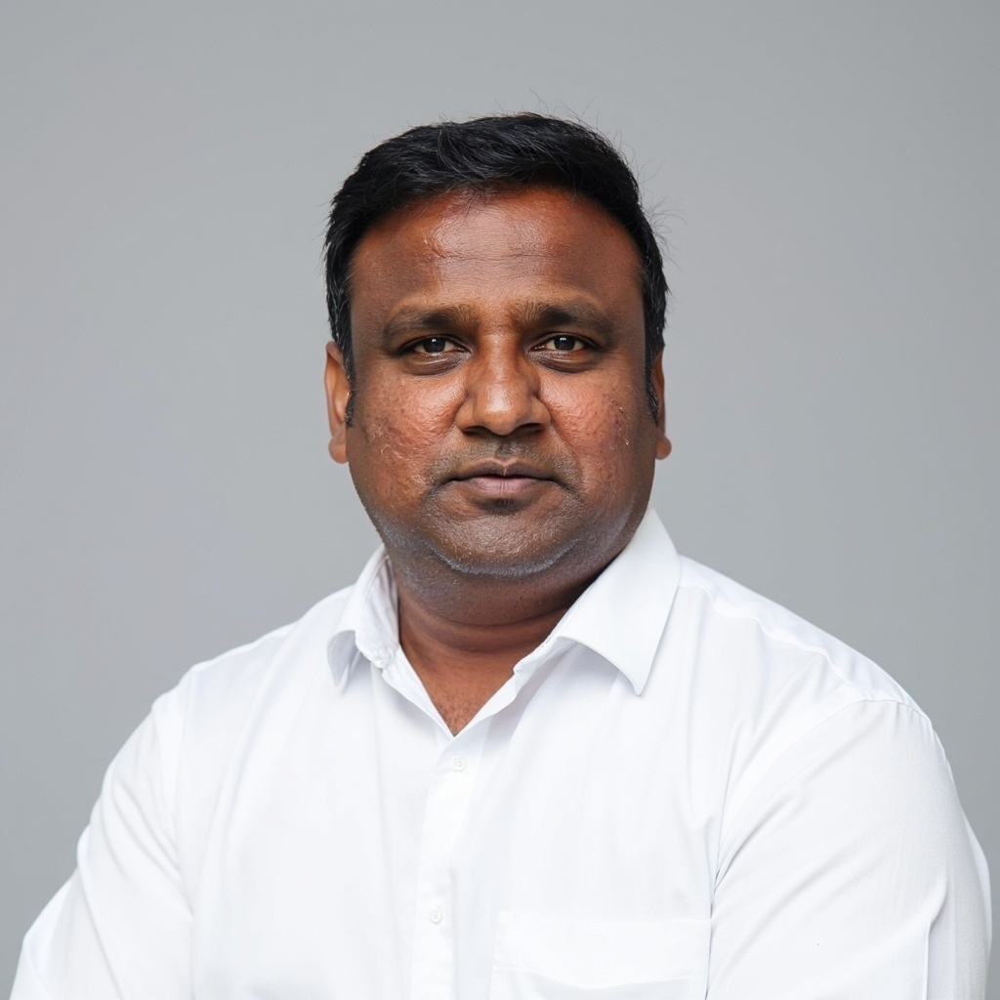

# அணிந்துரை

செயற்கை நுண்ணறிவு இன்று உலகளவில் கல்வி, தொழில்நுட்பம், நிர்வாகம், மருத்துவம், மொழி, கலை, சமூக வாழ்வு எனப் பல துறைகளில் வேகமாகப் பரவி வருகிறது. இவ்வேகமான மாற்றத்தின் வளர்ச்சியில், அத்தொழில்நுட்பத்தை நம் மொழியில் புரிந்து கொள்ளவும், விவாதிக்கவும், கற்பிக்கவும், பயன்படுத்தவும் தேவையான தமிழ்க் கலைச்சொற்கள் மிக முக்கியமானவை.



அந்தத் தேவையை உணர்ந்து, திரு. காங்கேயன் பசுபதி அவர்கள் உருவாக்கியுள்ள “AI அலை: நீங்கள் தயாரா? தமிழில் 300+ AI கலைச்சொற்கள்” என்ற இந்நூல், தமிழில் செயற்கை நுண்ணறிவு தொடர்பான கருத்துகளைப் புரிந்து கொள்ள பயனுள்ள வழிகாட்டியாக அமைந்துள்ளது.

இந்த நூலின் சிறப்பு, ஒவ்வொரு சொல்லின் பொருள், பயன்பாடு, கருத்து விளக்கம், புரிதலின் நோக்கம், சிந்தனைக்கான கேள்விகள், அத்தியாயச் சுருக்கம் போன்ற அம்சங்களுடன் அமைந்திருப்பதில்தான் உள்ளது. வெறும் ஆங்கில-தமிழ்ச் சொல் பட்டியலை விட இது மேலானது. மாணவர்கள், ஆசிரியர்கள், மொழிபெயர்ப்பாளர்கள், தொழில்நுட்ப வல்லுநர்கள், தமிழ் மொழி வல்லூனர்கள், நிர்வாகம் மற்றும் கொள்கைத் துறையில் இருப்பவர்கள் ஆகிய பல தரப்பு வாசகர்களுக்கும் இது பயன்படக்கூடியதாக உள்ளது. நூலின் முன்னுரையிலேயே, AI கலைச்சொற்கள் தமிழில் இன்னும் முழுமையாகத் தரப்படுத்தப்படவில்லை; அக்குறையை நிவர்த்தி செய்யும் முயற்சியாக இந்நூல் உருவாக்கப்பட்டுள்ளது என்று ஆசிரியர் தெளிவாகக் குறிப்பிடுகிறார்.

கலைச்சொல் உருவாக்கம் என்பது எளிய மொழிபெயர்ப்பு வேலை அல்ல. அது மொழி அறிவு, தொழில்நுட்பப் புரிதல், பயன்பாட்டு உணர்வு, காலத்தின் தேவையை உணரும் திறன் ஆகியவற்றின் முயற்சியாகும். குறிப்பாகச் செயற்கை நுண்ணறிவு போன்ற விரைவாக மாறும் துறையில், தமிழில் ஒரே சொல்லை ஒரே பொருளில் தொடர்ந்து பயன்படுத்தும் ஒழுங்கு உருவாக வேண்டியது அவசியம். அந்த நோக்கில் இந்த நூல் முக்கியமான பங்களிப்பாகப் பார்க்கப்படலாம்.

இந்நூலில் “செய்யறிவு” போன்ற சொற்கள் குறித்து ஆசிரியர் எடுத்துள்ள விளக்க முறையும் கவனிக்கத்தக்கது. ஒரு சொல்லைத் தேர்வு செய்வதற்குப் பின்னால் உள்ள மொழி, பயன்பாடு, சொல் உருவாக்கத் திறன், எதிர்காலச் சொல்லாக்க வாய்ப்பு ஆகியவற்றை விவரிக்க முயன்றிருப்பது பாராட்டத்தக்கது.

அதே நேரத்தில், தமிழில் கணினி மற்றும் செயற்கை நுண்ணறிவு தொடர்பான கலைச்சொற்கள் பல்வேறு வட்டாரங்களில் ஏற்கனவே உருவாக்கப்பட்டும் பயன்படுத்தப்பட்டும் வருகின்றன. இந்த நூலும் சில சொற்கள் சொல்லாய்வு குழுவினால் உருவாக்கப்பட்டவை என்பதைத் தெளிவாகக் குறிப்பிடுகிறது. எனவே, இப்பணியை “முழுக்க முழுக்க புதிய சொல் உருவாக்கம்” என்று பார்க்காமல், ஏற்கனவே உள்ள சொல்லாக்க மரபுகளையும், புதிய தேவைகளையும், கல்வி நோக்கத்தையும் இணைக்கும் தொகுப்பு விளக்க முயற்சியாகப் பார்ப்பது பொருத்தமானது.

தமிழ் மொழி தொழில்நுட்ப காலத்தோடு நடக்க வேண்டும் என்றால், இத்தகைய முயற்சிகள் அதிகம் தேவை. AI-ஐ தமிழில் பேசவும், கற்கவும், கற்பிக்கவும், விமர்சிக்கவும், பொறுப்புடன் பயன்படுத்தவும் இந்த நூல் பயனுள்ள தொடக்கமாக அமையும் என்று நம்புகிறேன்.

இம்முயற்சிக்காக ஆசிரியருக்கு என் வாழ்த்துகள். இந்நூல் தமிழ் வாசகர்கள் மத்தியில் செயற்கை நுண்ணறிவு பற்றிய ஆர்வத்தையும், தெளிவையும், விமர்சனங்களையும் வளர்க்கட்டும்.

அன்புடன்,

**புதுவை முருகு**

```pre
முருகவேலு வைத்தியனாதன்
எழுத்தாளர், செய்தியாளர்,
நடவு காலாண்டு இதழ் நிறுவனர்.
```
