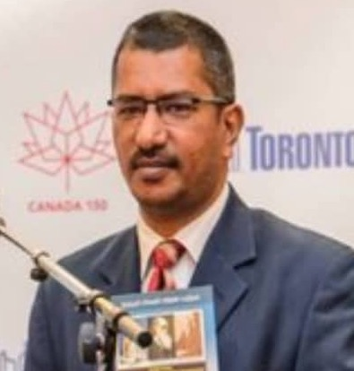

# சிறப்புரை

மொழியின் வாழ்நாளை அளவிட ஒரே ஒரு அளவுகோல் போதும். அந்த மொழி தன் காலத்தின் அறிவியலோடு இணைந்து பயணிக்கிறதா என்று பார்த்தாலே போதும். இலக்கணம், மருத்துவம், வானியல், கட்டிடக்கலை எனப் பல நூற்றாண்டுகளாகத் தமிழ் தனக்கான கலைச்சொற்களைத் தொடர்ந்து உருவாக்கிக் கொண்டே வந்திருக்கிறது. நம் முன்னோர்கள் கணிதத்தையும், வேளாண்மையையும், கடலோடிய தொழில்நுட்பங்களையும் எவ்விதத் தயக்கமுமின்றித் தமிழிலேயே பிழையறப் பேசினார்கள். ஆனால், இன்று “செய்யறிவு” (Artificial Intelligence) என்று வரும்போது தமிழில் பேச நாம் சற்றுத் தடுமாறுகிறோம். கலைச்சொல்லாக்கப் பணிகளில் நாம் போதிய அளவு ஈடுபடாமல் போனதன் விளைவே இந்தத் தடுமாற்றம்.

என் தந்தையார் மணவை முஸ்தபா அவர்கள் இந்த உண்மையை ஐம்பது ஆண்டுகளுக்கு முன்பே தீர்க்கமாக உணர்ந்தார். தமிழில் அறிவியலைப் பேசவேண்டும், படிக்கவேண்டும், கற்பிக்கவேண்டும் என்ற ஒற்றை இலக்கோடு, பத்து லட்சத்திற்கும் மேற்பட்ட கலைச்சொற்களை உருவாக்கி, மருத்துவம் தொடங்கி கணினியியல் வரை அத்தனை துறைகளையும் தமிழுக்குள் கொண்டுவர அவர் அயராது உழைத்தார். அவர் அமைத்துக்கொடுத்த பாதையில் இன்றுவரை பயணம் தொடர்கிறது. ஆயினும், ஒவ்வொரு புதிய தொழில்நுட்ப யுகமும் தனக்கான புதிய பாதைகளைக் கோருகிறது. அப்படிப்பட்ட செய்யறிவு யுகம் இப்போது நம் வாசலில் வந்து நிற்கிறது. அப்புதிய யுகத்தின் வாசலைத் திறக்கும் திறவுகோலாகவே காங்கேயன் பசுபதியின் இந்நூலைப் பார்க்கிறேன்.

இன்றைய காலகட்டத்தில் கல்வி, மருத்துவம், பொறியியல், வணிகம், தகவல் தொடர்பு என அனைத்துத் துறைகளிலும் செய்யறிவு ஆழமாக வேரூன்றிவிட்டது. மாணவன் தன் கைபேசியில் குரல் கட்டளை இடும்போதும், மருத்துவர் நோயைக் கண்டறியும் நவீனக் கருவிகளைப் பயன்படுத்தும்போதும், விவசாயி தன் பயிரைத் தாக்கிய நோயைப் புகைப்படத்தின் மூலம் கண்டறியும்போதும், அங்கே இந்தச் செய்யறிவுதான் நுட்பமாக இயங்குகிறது. இந்த இயக்கத்தைப் புரிந்துகொள்ளவும், விவாதிக்கவும், பகிரவும் தமிழில் சரியான வழியில்லை என்றால், தமிழர்கள் இம்மாற்றத்தை வழிநடத்துபவர்களாக அல்லாமல் வெறும் நுகர்வோர்களாகவே சுருங்கிவிடுவார்கள்.

ஒரு ரூபாய் அறிவியல் தமிழ் மன்றத்தின் செயல்பாடுகள் வழியாக கடந்த பல ஆண்டுகளாக நான் உணர்ந்த ஓர் உண்மை உண்டு. தமிழர்களுக்கு இயல்பாகவே அறிவியலில் பேரார்வம் இருக்கிறது. ஆனால், அந்த அறிவியலைத் தமிழில் படிப்பதற்கும் கேட்பதற்குமான வாய்ப்புகள்தான் இங்கே மிகக் குறைவு. அந்தக் குறையைப் போக்கும் கருவியே கலைச்சொல்லாக்கம். சரியான கலைச்சொற்கள் கிடைத்துவிட்டால், சிறு நகரத்தில் படிக்கும் மாணவனும் செய்யறிவைப் பற்றி எந்தவிதத் தயக்கமுமின்றித் தெளிவாகப் பேசுவான். அதேசமயம், தெளிவான கலைச்சொற்கள் இல்லாத பட்சத்தில், ஆங்கிலம் கற்றவர்களுக்கு மட்டுமே அணுகக்கூடிய ஒரு துறையாக இது சுருங்கிவிடும். எனவே, கலைச்சொல்லாக்கம் சமூக நீதியோடும், நாம் பின்பற்றும் அறத்தோடும் தொடர்புடையது.

இந்நூலின் மிக முக்கியமான தனிச்சிறப்பு, ஒவ்வொரு கலைச்சொல்லுக்கும் தரப்பட்டுள்ள வேர்ச்சொல் விளக்கமே ஆகும். “செய் + அறிவு = செய்யறிவு” என்று அதன் வேரை விளக்கும்போது, அச்சொல் வாசகரின் மனதில் மிக எளிதாகப் பதிந்துவிடுகிறது. அவர்கள் அதனை மறக்காமல் பயன்படுத்துவார்கள். சொல்லோடு அதன் உயிரோட்டத்தையும் இணைத்து வழங்கவேண்டும் என்ற அடிப்படையை என் தந்தையார் முழுமையாக நம்பினார். அதனால்தான் அவர் உருவாக்கிய சொற்கள் படிப்பதற்கு எளிமையாகவும், புரிந்துகொள்ள இயல்பாகவும் இருந்தன. அதே செயல்முறையைக் காங்கேயன் பசுபதியும் இந்நூலில் மிகச் சரியாகப் பின்பற்றியுள்ளார்.

கலைச்சொல் உருவாக்கத்தில் பொதுவாக இரண்டு மரபுகள் பின்பற்றப்படுகின்றன. ஒன்று, ஆங்கிலச் சொற்களை அப்படியே ஒலிபெயர்த்துப் பயன்படுத்துவது. மற்றொன்று, தமிழ் வேர்ச்சொற்களிலிருந்து புதிய சொற்களை உருவாக்குவது. இந்நூல் இவ்விரண்டின் தேவையையும் சரியாக உணர்ந்து, தமிழ் வேரிலிருந்து பிறக்கும் சொற்களுக்கு அதிக முன்னுரிமை அளித்துள்ளது. மேலும், சொல்லாய்வுக் குழுவின் பங்களிப்பை வெளிப்படையாக ஏற்றுப் பதிவு செய்திருப்பது, ஆசிரியரின் அறப்பண்பைக் காட்டுகிறது. கலைச்சொல் உருவாக்கம் மொழியின் பொதுச்சொத்து. அறம் சார்ந்து இதனை உணர்ந்தவர்கள் மட்டுமே உண்மையான மொழித்தொண்டர்கள்.

இந்நூல் பல தரப்பட்ட வாசகர்களுக்கும் பெருமளவில் பயன்படும். செய்யறிவை முதன்முதலாகக் கற்க வரும் மாணவர்களுக்கு இது தெளிவான வழிகாட்டி. ஏற்கனவே இத்துறையில் பணியாற்றும் தகவல் தொழில்நுட்பப் பொறியாளர்களுக்கு, தங்கள் அன்றாடப் பணிகளைத் தமிழில் பகிர்ந்துகொள்ள இது பெரும் திறனை அளிக்கும். ஆசிரியர்களுக்கும் மொழிபெயர்ப்பாளர்களுக்கும் இது நம்பகமான கலைச்சொல் களஞ்சியமாக நிலைத்து நிற்கும்.

“தமிழ் வாழவேண்டும் என்றால் தமிழ் பயன்படவேண்டும். பயன்படவேண்டும் என்றால் தமிழில் அறிவியல் பேசவேண்டும்” என்பதே என் தந்தையாரின் தாரக மந்திரம். தன் வாழ்நாள் முழுவதும் அந்தத் தத்துவத்தை அவர் செயலில் வாழ்ந்துகாட்டினார். அந்தத் தத்துவத்தைச் செய்யறிவின் காலத்திற்கும் விரிவுபடுத்துகிறது இந்நூல். செய்யறிவைப் பற்றித் தமிழில் எந்தவிதத் தயக்கமும் இன்றித் தைரியமாகப் பேசும் புதிய தலைமுறை உருவாகட்டும். அந்தத் தலைமுறையின் கரங்களில் இந்நூல் வலிமையான கருவியாகச் செயல்படும் என்று முழு நம்பிக்கையோடு கூறுகிறேன்.



வாழ்த்துகளுடன்,

**பேராசிரியர் மருத்துவர் செம்மல் முஸ்தபா**

```pre
மருத்துவக் கல்வி பேராசிரியர்
ஷக்ரா பல்கலைக்கழகம், இராயல் மாகாணம், சவூதி அரேபியா
நிறுவனர் மற்றும் தலைமை அறிவியல் ஆலோசகர்
சர்வதேச செயல்முறைத் தமிழ் குழு (IATT) மற்றும் ஒரு ரூபாய் அறிவியல் தமிழ் மன்றம்
சவூதி அரேபியா, ஜூலை 15, 2026
```
