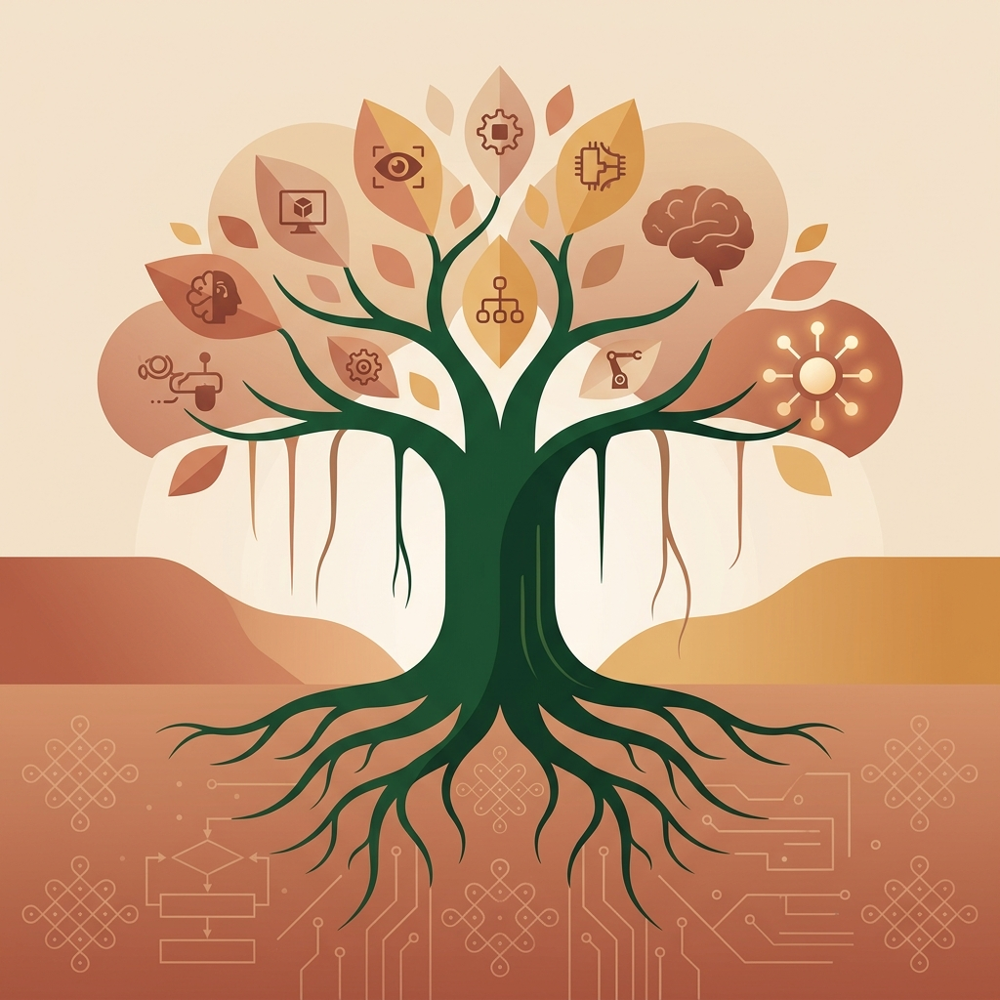

<!-- _class: lead -->
<!-- _paginate: false -->

அத்தியாயம் 1பகுதி 1

# செய்யறிவு நிலைகள் = செய் + அறிவு

## AI · AGI · ASI: 15 நிமிட நுண் பயிலரங்கு

நூல்: AI அலை: நீங்கள் தயாரா? | நுண் பயிலரங்கு

---

# 1950: ஆலன் டூரிங்கின் கேள்வி

"இயந்திரங்களால் சிந்திக்க முடியுமா?"

இந்தக் கேள்விதான் இன்றைய செய்யறிவுத் துறையின் தொடக்கம். அன்று தொடங்கிய பயணம் இன்று மூன்று நிலைகளாகப் பிரிக்கப்படுகிறது.

---

# செய்யறிவு நிலைகள் வரைபடம்

---

<!-- _class: term -->

# Artificial Intelligence: செய்யறிவு

செய் + அறிவு

மனித அறிவைப் போலச் செயல்படும் திறன் கொண்ட கணினி அமைப்புகள். இன்று நடைமுறையில் இருப்பது இந்த "குறுகிய செய்யறிவு" மட்டுமே.

> 📌 மாற்றுச் சொல்: செயற்கை நுண்ணறிவு

---

<!-- _class: term -->

# Artificial General Intelligence: பொதுச் செய்யறிவு

பொது + செய்யறிவு

மனிதனைப் போல எந்தத் துறையிலும் பொதுவாகச் சிந்திக்கவும், கற்கவும், சிக்கல் தீர்க்கவும் வல்ல AI நிலை.

> 📌 இன்னும்: ஆராய்ச்சி நிலையில் மட்டுமே உள்ளது, நடைமுறையில் இல்லை.

---

<!-- _class: term -->

# Artificial Super Intelligence: செய்மீயறிவு

செய் + மீ + அறிவு

"மீ" முன்னொட்டு "மீக்கணிப்பொறி" (super computer) போல் பயன்படுத்தப்படுகிறது. ஒட்டுமொத்த மனித அறிவையும் தாண்டிய திறமைகளைக் கொண்ட கற்பனை AI நிலை.

குறுகிய AI (இன்று) &rarr; பொதுச் AGI (ஆராய்ச்சி) &rarr; ASI (கற்பனை)

---

<!-- _class: chat-check -->

# வினா: இந்தச் சொல் எது?

"மனிதனைப் போல எந்தத் துறையிலும் பொதுவாகச் சிந்திக்கவும், கற்கவும், சிக்கல் தீர்க்கவும் வல்ல AI நிலை"

Discuss

அறையில் உள்ளவர்களே பதில் சொல்லுங்கள்! 10 வினாடிகள்.

---

<!-- _class: chat-check-answer -->

# விடை: பொதுச் செய்யறிவு (AGI)

இன்று நடைமுறையில் இருப்பது குறுகிய செய்யறிவு (AI) மட்டுமே. AGI-யும் ASI-யும் இன்னும் ஆராய்ச்சி நிலையில் அல்லது கற்பனையில் மட்டுமே உள்ளன.

---

# இன்று கற்ற 3 சொற்கள்

நிலை 1<h3>செய்யறிவு</h3>
AI: இன்று நடைமுறையில்

நிலை 2<h3>பொதுச் செய்யறிவு</h3>
AGI: ஆராய்ச்சி நிலையில்

நிலை 3<h3>செய்மீயறிவு</h3>
ASI: கற்பனை நிலையில்

---

<!-- _class: lead -->
<!-- _paginate: false -->

அத்தியாயம் 1பகுதி 2

# அடுத்து: நவீன AI வகைகள்

செய்யறிவு நிலைகள்: முடிந்தது

ஆசிரியர்: கங்கா (காங்கேயன் பசுபதி) 
கங்கா வளர் தொழில்நுட்பக் கலைச்சொல் ஆய்விருக்கை, யூ.எஸ்.ஏ. Ganga Emerging Technology Terminology Research Chair, USA

