<!-- _class: lead -->
<!-- _paginate: false -->

TNC55அத்தியாயம் 1பகுதி 4

# திறந்தநிலையும் அடித்தளமும் = திறந்த + அடித்தளம்

## Openness & Foundation: 15 நிமிட நுண் பயிலரங்கு

நூல்: AI அலை: நீங்கள் தயாரா? | நுண் பயிலரங்கு

---

# AI மாதிரிகள் எப்படி வெளியிடப்படுகின்றன?

AI மாதிரிகளின் வெளியீட்டு முறை தொழில்துறையின் போக்கை நிர்ணயிக்கிறது. சில மாதிரிகள் முழுமையாகத் திறந்த மூலமாக வெளியிடப்படுகின்றன, சில எடைகளை மட்டும் பகிர்கின்றன. இவை அனைத்தும் ஒரு பொதுவான அடித்தள மாதிரியிலிருந்து கட்டமைக்கப்படுகின்றன.

---

# வெளியீட்டு முறை வரைபடம்

---

<!-- _class: term -->

# திறந்த மூலம் vs திறந்த எடை

<h3>Open Source AI திறந்த மூலச் செய்யறிவு</h3>

மூலக் குறிமுறை, எடைகள், பயிற்சித் தரவு ஆகியவை அனைத்தும் பொதுவில்.

VS

<h3>Open Weight திறந்த எடை</h3>

பயிற்சி பெற்ற எடைகள் மட்டுமே பொதுவில் (உ-ம்: Llama, Gemma).

---

<!-- _class: term -->

# Foundation Model: அடிப்படை மாதிரி

பல்வேறு வேலைகளுக்கு அடித்தளமாக அமையும் பெரும் முன்பயிற்சி பெற்ற AI மாதிரி.

உதாரணம்

GPT, Claude, Gemini. இவற்றின் மேல் பல பயன்பாடுகள் கட்டப்படுகின்றன.

---

<!-- _class: chat-check -->

# வினா: எது எது?

"பயிற்சி பெற்ற எடைகள் மட்டும் பொதுவில் வெளியிடப்படும், ஆனால் பயிற்சிக் குறிமுறை பொதுவில் இல்லாமல் இருக்கலாம்"

Discuss

அறையில் உள்ளவர்களே பதில் சொல்லுங்கள்! 10 வினாடிகள்.

---

<!-- _class: chat-check-answer -->

# விடை: திறந்த எடை (Open Weight)

திறந்த மூலச் செய்யறிவு (Open Source AI) மூலக் குறிமுறை, எடைகள், பயிற்சித் தரவு அனைத்தையும் பொதுவில் தரும். திறந்த எடை (Open Weight) எடைகளை மட்டும் தரும்.

---

# இன்று கற்ற 3 சொற்கள்

வெளியீடு<h3>திறந்த மூலம்</h3>
Open Source AI

வெளியீடு<h3>திறந்த எடை</h3>
Open Weight

அடித்தளம்<h3>அடிப்படை மாதிரி</h3>
Foundation Model

---

<!-- _class: lead -->
<!-- _paginate: false -->

TNC55அத்தியாயம் 1பகுதி 5

# அடுத்து: அடிப்படைக் கருத்துகள்

திறந்தநிலையும் அடித்தளமும்: முடிந்தது

கங்கா வளர் தொழில்நுட்பக் கலைச்சொல் ஆய்விருக்கை, யூ.எஸ்.ஏ. Ganga Emerging Technology Terminology Research Chair, USA

