<!-- _class: lead -->
<!-- _paginate: false -->

அத்தியாயம் 1பகுதி 6

# அணுகுமுறைகள் = குறி + இயக்கியம்

## Connectionism · Symbolism: 15 நிமிட நுண் பயிலரங்கு

நூல்: AI அலை: நீங்கள் தயாரா? | நுண் பயிலரங்கு

---

# இருவெவ்வேறு சிந்தனைப் பள்ளிகள்

செய்யறிவின் அடிப்படையில் இரு முதன்மை அணுகுமுறைகள் இருக்கின்றன. ஒன்று விதிகளையும் ஏரணத்தையும் நம்பியது. மற்றொன்று நரம்பணு வலைப்பின்னலை ஒத்திருக்க முயன்றது. இன்றைய பெருமொழி மாதிரிகள் இவ்விரண்டின் கலவையிலிருந்து பிறந்தவை.

---

# AI அணுகுமுறைகள் வரைபடம்

---

<!-- _class: term -->

# Symbolism: குறியியக்கியம்

குறி (sign/symbol) + இயக்கியம் (-ism / theory)

விதிகளையும் ஏரணத்தையும் பயன்படுத்தித் தரவுகளைக் குறியீடுகள் மூலம் மனித அறிவாகக் கணினிக்குப் புகட்டும் முற்காலச் செய்யறிவு அணுகுமுறை.

> 📌 மாற்றுச் சொல்: குறியீட்டு அணுகுமுறை

---

<!-- _class: term -->

# Connectionism: இணைப்புக்கொள்கை

இணைப்பு (connection) + கொள்கை (theory)

மூளையின் நரம்பணு வலைப்பின்னலைப் போலக் கணினி அமைப்புகளையும் ஒன்றோடொன்று இணைத்துச் செயல்பட வைக்கும் அணுகுமுறை.

> 📌 மாற்றுச் சொல்: இணைப்பியக்கம்

---

<!-- _class: chat-check -->

# வினா: இது எந்த அணுகுமுறை?

"மூளையின் நரம்பணு வலைப்பின்னலைப் போலக் கணினி அமைப்புகளை இணைத்துச் செயல்பட வைக்கும் அணுகுமுறை"

Discuss

அறையில் உள்ளவர்களே பதில் சொல்லுங்கள்! 10 வினாடிகள்.

---

<!-- _class: chat-check-answer -->

# விடை: இணைப்புக்கொள்கை (Connectionism)

குறியியக்கியம் (Symbolism) விதிகளையும் ஏரணத்தையும் நம்பியது. இணைப்புக்கொள்கை (Connectionism) நரம்பணு வலைப்பின்னலை ஒத்தது. இன்றைய நரவலைகள் (Neural Networks) இணைப்புக்கொள்கையிலிருந்து வந்தவை.

---

# 📰 AI வரலாற்றில் ஒரு துளி

1956, டார்ட்மவுத் கல்லூரி. ஜான் மெக்கார்த்தி மற்றும் மார்வின் மின்ஸ்கி "செயற்கை நுண்ணறிவு" என்ற சொல்லை முதன்முதலில் பயன்படுத்தினர். அந்த முதல் தலைமுறை AI முழுக்க குறியியக்கியத்தை (Symbolism) நம்பியிருந்தது.

அவர்கள் நினைத்தது: "ஒரே கோடைகாலத்தில் முடிந்துவிடும்." உண்மையில் அது இன்னும் தொடரும் பயணம்.

---

# இன்று கற்ற 2 சொற்கள்

அணுகுமுறை<h3>குறியியக்கியம்</h3>
Symbolism: விதிசார்

அணுகுமுறை<h3>இணைப்புக்கொள்கை</h3>
Connectionism: நரம்பணு சார்

---

<!-- _class: lead -->
<!-- _paginate: false -->

அத்தியாயம் 1பகுதி 6

# நன்றி!

அணுகுமுறைகள்: அத்தியாயம் 1 நிறைவு
ஆசிரியர்: காங்கேயன் பசுபதி

கங்கா வளர் தொழில்நுட்பக் கலைச்சொல் ஆய்விருக்கை, யூ.எஸ்.ஏ. Ganga Emerging Technology Terminology Research Chair, USA

